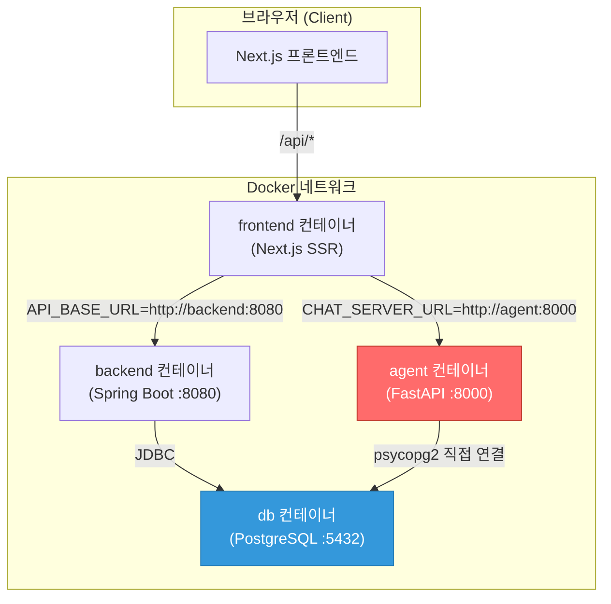
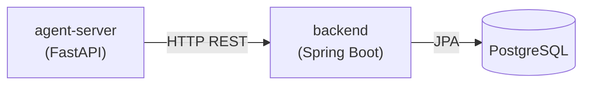

# 🔍 AI ↔ 백엔드 통신 구조 분석

## 핵심 결론

> **현재 AI(agent-server)와 백엔드(Spring Boot)는 서로 직접 통신하지 않습니다.**  
> AI 서버가 **백엔드를 우회하고 DB에 직접 SQL을 실행**하는 구조입니다.

---

## 현재 아키텍처



### 통신 경로 요약

| 경로 | 방식 | 용도 |
|------|------|------|
| **프론트 → 백엔드** | `http://backend:8080` (REST API) | 주문, 메뉴, 인증 등 모든 비즈니스 로직 |
| **프론트 → AI** | `http://agent:8000` (SSE/REST) | 채팅 메시지 전달, AI 응답 스트리밍 |
| **AI → DB** | `psycopg2` (직접 SQL) | 메뉴 조회, 주문 조회, 사용자 정보 등 |
| **AI → 백엔드** | ❌ **없음** | — |

---

## 상세 분석

### 1. 프론트엔드 → AI 서버 통신

프론트엔드의 `app/api/chat/route.ts`가 Next.js API Route로 동작하며, AI 서버에 **프록시** 역할을 합니다:

```
[브라우저] → POST /api/chat → [Next.js SSR] → POST http://agent:8000/chat → [FastAPI]
```

- **일반 모드**: JSON 응답 반환
- **스트리밍 모드**: SSE(Server-Sent Events)로 실시간 텍스트 전달
- 세션별 대화 히스토리를 Next.js 서버 메모리에 저장

### 2. AI 서버의 데이터 접근 방식

AI 서버(`agent-server/app/services/`)는 **Spring Boot 백엔드 API를 전혀 호출하지 않고**, `psycopg2`로 PostgreSQL에 직접 접속합니다:

```python
# agent-server/app/services/database.py
def get_connection():
    return psycopg2.connect(
        host=DB_HOST,    # Docker에서는 "db"
        port=DB_PORT,
        dbname=DB_NAME,
        user=DB_USER,
        password=DB_PASSWORD
    )
```

`tools.py`에서 직접 SQL을 실행하는 예시들:

| Tool 함수 | 직접 실행하는 SQL |
|-----------|-----------------|
| `get_my_info` | `SELECT ... FROM users WHERE id = %s` |
| `get_queue_status` | `SELECT COUNT(*) FROM orders WHERE status = 'PREPARING'` |
| `check_order_status` | `SELECT ... FROM orders o JOIN order_items oi ...` |
| `get_popular_menus` | `SELECT ... FROM order_items oi JOIN orders o ...` |
| `search_menus_by_filter` | `SELECT ... FROM menus m JOIN categories c ...` |
| `reorder_last` | `SELECT ... FROM orders o JOIN order_items oi ...` |
| `calculate_price` | `SELECT ... FROM menus WHERE ...` |
| 메뉴-슬러그 매핑 | `SELECT kor_name, eng_name FROM menus` |

---

## 🚨 문제점

### 1. 헥사고날 아키텍처 위반
- 백엔드의 `application/port/out/` (아웃바운드 포트)에 AI 관련 인터페이스가 없는 이유는, **AI가 백엔드를 거치지 않기 때문**
- 비즈니스 로직(등급 계산, 포인트 조회 등)이 AI 서버의 `tools.py`에 **중복 구현**되어 있음

### 2. 비즈니스 로직 중복
```
백엔드: GetOrderService → OrderRepositoryPort → OrderPersistenceAdapter
AI:     tools.py → execute_query("SELECT ... FROM orders ...")  ← 같은 데이터인데 별도 로직
```
- 등급 계산 로직이 `tools.py`에도, 백엔드 `UserGradeService`에도 존재
- 한쪽을 수정하면 다른쪽도 수정해야 하는 **이중 관리** 문제

### 3. DB 스키마 결합
- AI 서버가 테이블/컬럼명에 직접 의존 → DB 스키마 변경 시 AI 서버도 수정 필요
- 백엔드의 JPA Entity ↔ Domain 매핑이 AI에는 적용되지 않음

### 4. 보안 우려
- AI 서버가 DB에 직접 접속하므로, 백엔드의 인증/인가 체계가 AI 데이터 접근에 적용되지 않음

---

## 💡 개선 방안

### 방안 A: AI → 백엔드 REST API 호출 (권장)

AI 서버가 DB 대신 **백엔드 API를 호출**하도록 변경:



**변경 사항:**
1. AI의 `tools.py`에서 `execute_query()` → `requests.get("http://backend:8080/api/...")` 로 변경
2. 백엔드에 AI 전용 내부 API 엔드포인트 추가 (또는 기존 API 활용)
3. `database.py` 직접 DB 연결 제거

**장점:** 비즈니스 로직 단일 관리, 헥사고날 원칙 준수, 보안 강화

### 방안 B: 백엔드에 AI 아웃바운드 포트 추가

백엔드가 AI에 요청을 보내야 하는 경우 (예: AI 추천, 자동 분류 등):

```
backend/
└── ai/
    ├── application/
    │   └── port/
    │       └── out/
    │           └── AiRecommendationPort.java    ← 아웃바운드 포트
    └── adapter/
        └── out/
            └── api/
                └── AiApiAdapter.java            ← HTTP 호출 구현체
```

### 방안 C: 현재 구조 유지 (현실적)

현재 구조를 유지하되, 다음을 보완:
- AI 서버의 SQL 쿼리를 **읽기 전용(SELECT)**으로 제한 (현재도 그렇긴 함)
- DB 사용자 권한을 **READ-ONLY**로 분리
- 스키마 변경 시 AI 서버도 함께 수정하는 체크리스트 관리

---

## 현재 구조가 된 이유 (추정)

1. AI 서버가 **독립 Python 프로세스**로 분리되면서, Spring Boot API를 호출하는 것보다 DB 직접 접속이 더 간단했음
2. AI Tool들이 **읽기 전용** 쿼리만 수행하므로 데이터 무결성 위험이 낮음
3. 프론트엔드 → AI 경로에서 **프론트엔드 → 백엔드 → AI** 형태의 3-hop보다, **프론트 → AI(DB 직접)** 2-hop이 응답 속도 면에서 유리

> [!IMPORTANT]
> 현재 `백엔드 port/out/`에 AI 폴더가 없는 것은 **설계 누락이 아니라, AI가 백엔드를 거치지 않는 아키텍처이기 때문**입니다.
