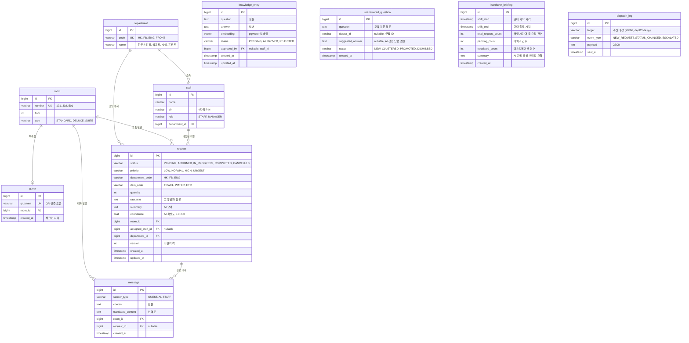

# 아늑(Aneuk) ERD



## 테이블 요약

| 테이블 | 설명 | 레코드 수명 |
|--------|------|-----------|
| **department** | 부서 (HK, FB, ENG, FRONT) | 영구 |
| **room** | 객실 정보 | 영구 |
| **staff** | 직원 (PIN 로그인) | 영구 |
| **guest** | QR 토큰 ↔ 객실 매핑 (인증 전용) | 체크아웃 시 **Hard Delete** |
| **request** | 고객 요청 (핵심 테이블) | 영구 보존 |
| **message** | AI 대화 메시지 | 영구 보존 (원문 증거) |
| **knowledge_entry** | RAG 지식 DB | 영구 (승인된 것만 검색 대상) |
| **unanswered_question** | 미답변 질문 (플라이휠 소스) | 승인 후 knowledge_entry로 승격 |
| **handover_briefing** | 교대 인수인계 브리핑 (AI 자동 생성) | 영구 보존 |
| **dispatch_log** | 실시간 알림 발송 이력 | 영구 (감사 로그) |

## 핵심 관계 설명

1. **guest ↔ room**: 1:1 (QR 토큰 ↔ 객실 매핑, 체크아웃 시 Hard Delete)
2. **room → request**: 1:N (한 객실에서 여러 요청 발생)
3. **room → message**: 1:N (한 객실에서 여러 대화 발생)
4. **request → department**: N:1 (요청은 하나의 부서로 라우팅)
5. **request → staff**: N:1 (요청은 한 직원에게 배정, nullable)
6. **request → message**: 1:N (요청과 관련된 대화)

## 인수인계 브리핑 자동 생성 로직

```
교대 버튼 클릭
    │
    ▼
[백엔드] shift_start ~ shift_end 기간의 request 조회
    ├── ① 미완료 태스크 (status != COMPLETED)
    ├── ② 에스컬레이션 거친 특이사항 (confidence < 0.7 또는 ESCALATED)
    └── ③ 긴급/주요 완료 건 (priority = URGENT, HIGH)
    │
    ▼ (JSON으로 AI 서버에 전달)
[AI] 3~5줄 자연어 브리핑 자동 생성
    │
    ▼
[handover_briefing] 저장 (통계 + AI 요약)
```

> **핵심**: 직원이 인수인계 내용을 직접 작성하지 않음.
> request + message 데이터가 자동으로 취합되어 AI가 요약합니다.


