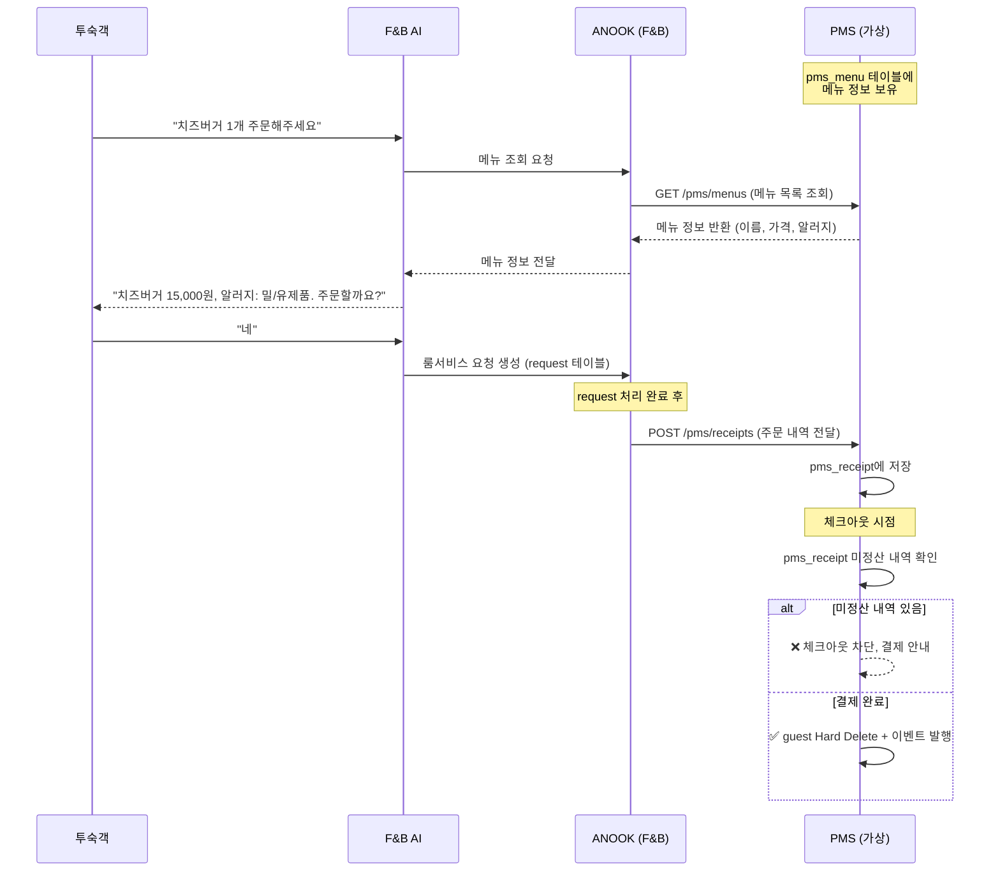

# 🍽️ 룸서비스 결제 연동 설계서 (PMS ↔ F&B)

> **AN-236**: 체크아웃 시 룸서비스 결재 검증 후 체크아웃 로직  
> **AN-237**: (더미) 메뉴 테이블 생성 (가격, 메뉴명, 알러지 등)

---

## 1. 전체 워크플로우



---

## 2. 신규 테이블 설계

### 2-1. `pms_menu` (PMS 소유 — 메뉴 마스터)

| 컬럼 | 타입 | 설명 |
|------|------|------|
| `id` | `BIGSERIAL PK` | 메뉴 ID |
| `name` | `VARCHAR(100) NOT NULL` | 메뉴명 |
| `price` | `INTEGER NOT NULL` | 가격 (원) |
| `category` | `VARCHAR(30) NOT NULL` | 카테고리 (MAIN, SIDE, DRINK, DESSERT) |
| `allergens` | `VARCHAR(200)` | 알러지 유발 재료 (쉼표 구분, 예: "밀,유제품,계란") |
| `available` | `BOOLEAN DEFAULT TRUE` | 주문 가능 여부 |

```sql
CREATE TABLE IF NOT EXISTS pms_menu (
    id          BIGSERIAL    PRIMARY KEY,
    name        VARCHAR(100) NOT NULL,
    price       INTEGER      NOT NULL,
    category    VARCHAR(30)  NOT NULL,
    allergens   VARCHAR(200),
    available   BOOLEAN      NOT NULL DEFAULT TRUE
);
```

### 2-2. `pms_receipt` (PMS 소유 — 룸서비스 주문 내역)

| 컬럼 | 타입 | 설명 |
|------|------|------|
| `id` | `BIGSERIAL PK` | 영수증 항목 ID |
| `room_no` | `VARCHAR(10) NOT NULL` | 객실 번호 (FK → pms_room) |
| `menu_id` | `BIGINT NOT NULL` | 메뉴 ID (FK → pms_menu) |
| `quantity` | `INTEGER NOT NULL DEFAULT 1` | 수량 |
| `total_price` | `INTEGER NOT NULL` | 소계 (price × quantity) |
| `status` | `VARCHAR(20) DEFAULT 'UNPAID'` | 결제 상태: `UNPAID` / `PAID` |
| `created_at` | `TIMESTAMP DEFAULT NOW()` | 주문 시각 |

```sql
CREATE TABLE IF NOT EXISTS pms_receipt (
    id          BIGSERIAL    PRIMARY KEY,
    room_no     VARCHAR(10)  NOT NULL REFERENCES pms_room(number),
    menu_id     BIGINT       NOT NULL REFERENCES pms_menu(id),
    quantity    INTEGER      NOT NULL DEFAULT 1,
    total_price INTEGER      NOT NULL,
    status      VARCHAR(20)  NOT NULL DEFAULT 'UNPAID',
    created_at  TIMESTAMP    NOT NULL DEFAULT NOW()
);
```

---

## 3. 모듈 간 통신 인터페이스

### 3-1. ANOOK(F&B) → PMS 방향: 메뉴 조회

> **F&B AI가 메뉴 정보를 조회**할 때 사용

```
[F&B 모듈]                    [PMS 모듈]
MenuQueryPort (interface)  ←─ MenuQueryAdapter (JdbcTemplate)
    ↑                              ↓
F&B AI Service              pms_menu 테이블 SELECT
```

**Port 정의** (F&B 모듈 소유):
```java
// fb/application/port/out/MenuQueryPort.java
public interface MenuQueryPort {
    List<MenuInfo> findAvailableMenus();
    Optional<MenuInfo> findById(Long menuId);
}
```

**MenuInfo DTO** (F&B 모듈 소유 — PMS 도메인에 의존하지 않음):
```java
public record MenuInfo(
    Long id,
    String name,
    int price,
    String category,
    String allergens
) {}
```

### 3-2. ANOOK(F&B) → PMS 방향: 주문 내역 전달

> **룸서비스 완료 후 PMS에 영수증 기록**할 때 사용

```
[F&B 모듈]                         [PMS 모듈]
ReceiptSubmitPort (interface)  ←─  ReceiptSubmitAdapter (JdbcTemplate)
    ↑                                    ↓
F&B Service                      pms_receipt 테이블 INSERT
```

**Port 정의** (F&B 모듈 소유):
```java
// fb/application/port/out/ReceiptSubmitPort.java
public interface ReceiptSubmitPort {
    void submitReceipt(String roomNo, Long menuId, int quantity, int totalPrice);
}
```

### 3-3. PMS 내부: 체크아웃 검증

> **체크아웃 시 미결제 룸서비스 확인** (PMS 내부 로직)

```java
// guest/application/port/out/ReceiptQueryPort.java
public interface ReceiptQueryPort {
    boolean hasUnpaidReceipts(String roomNo);
    List<ReceiptInfo> findUnpaidByRoomNo(String roomNo);
}
```

---

## 4. API 엔드포인트

### PMS 측 API (PmsMenuController, PmsReceiptController)

| Method | Path | 설명 | 담당 |
|--------|------|------|------|
| `GET` | `/pms/menus` | 전체 메뉴 목록 조회 | **PM (AN-237)** |
| `GET` | `/pms/menus/{id}` | 메뉴 상세 조회 | **PM (AN-237)** |
| `POST` | `/pms/receipts` | 룸서비스 주문 내역 전달 | **PM (AN-236)** |
| `GET` | `/pms/receipts?roomNo={roomNo}` | 특정 객실 주문 내역 조회 | **PM (AN-236)** |
| `PATCH` | `/pms/receipts/{id}/pay` | 결제 처리 (UNPAID → PAID) | **PM (AN-236)** |
| `PATCH` | `/pms/receipts/pay-all?roomNo={roomNo}` | 객실 전체 일괄 결제 | **PM (AN-236)** |

### ANOOK(F&B) 측 연동 포인트

| 연동 포인트 | 설명 | 담당 |
|------------|------|------|
| `MenuQueryPort` 구현체 | pms_menu 읽기 (JdbcTemplate) | **F&B 담당자** |
| `ReceiptSubmitPort` 구현체 | pms_receipt INSERT (JdbcTemplate) | **F&B 담당자** |
| F&B AI 서비스에서 메뉴 조회 | MenuQueryPort 호출 | **F&B 담당자** |

---

## 5. 체크아웃 프로세스 (변경 후)

```
체크아웃 버튼 클릭
    │
    ├─ 1) 투숙객 존재 확인 ✅ (기존)
    │
    ├─ 2) 미정산 F&B request 확인 ✅ (기존 — request 테이블)
    │
    ├─ 3) 미결제 룸서비스 영수증 확인 🆕 (pms_receipt WHERE status='UNPAID')
    │   ├─ 있으면 → ❌ 체크아웃 차단
    │   │           → 미결제 내역 팝업 표시 (메뉴명, 수량, 금액)
    │   │           → [일괄 결제] 버튼 제공
    │   └─ 없으면 → 다음 단계
    │
    ├─ 4) Hard Delete (pms_guest) ✅ (기존)
    │
    └─ 5) 이벤트 발행 (GuestCheckedOutEvent) ✅ (기존)
```

---

## 6. PMS 프론트엔드 체크아웃 시나리오

### Case A: 미결제 룸서비스 없음
```
[체크아웃] 클릭 → "체크아웃 하시겠습니까?" → 확인 → 완료
```

### Case B: 미결제 룸서비스 있음
```
[체크아웃] 클릭 → ❌ "미결제 룸서비스가 있습니다"
    ┌──────────────────────────────────┐
    │ 🧾 미결제 룸서비스 내역          │
    │                                  │
    │  치즈버거   x1   15,000원        │
    │  콜라       x2    8,000원        │
    │  ──────────────────────          │
    │  합계            23,000원        │
    │                                  │
    │  [일괄 결제]    [취소]            │
    └──────────────────────────────────┘
    → [일괄 결제] 클릭 → 체크아웃 자동 진행
```

---

## 7. 더미 메뉴 데이터 (data.sql)

```sql
INSERT INTO pms_menu (name, price, category, allergens, available) VALUES
    -- MAIN
    ('클래식 치즈버거',      15000, 'MAIN',    '밀,유제품',       TRUE),
    ('트러플 머쉬룸 리조또', 28000, 'MAIN',    '유제품',          TRUE),
    ('한우 불고기 덮밥',     22000, 'MAIN',    '대두,밀',         TRUE),
    ('시저 샐러드',          14000, 'MAIN',    '유제품,계란',     TRUE),
    ('해산물 파스타',        25000, 'MAIN',    '밀,갑각류,연체류', TRUE),
    ('스테이크 샌드위치',    20000, 'MAIN',    '밀,유제품',       TRUE),
    -- SIDE
    ('감자튀김',             8000,  'SIDE',    NULL,              TRUE),
    ('시즌 과일 플레이트',   12000, 'SIDE',    NULL,              TRUE),
    ('모짜렐라 스틱',        10000, 'SIDE',    '밀,유제품',       TRUE),
    -- DRINK
    ('콜라',                 4000,  'DRINK',   NULL,              TRUE),
    ('오렌지 주스',          6000,  'DRINK',   NULL,              TRUE),
    ('아메리카노',           5000,  'DRINK',   NULL,              TRUE),
    ('캐모마일 티',          5000,  'DRINK',   NULL,              TRUE),
    -- DESSERT
    ('뉴욕 치즈케이크',      12000, 'DESSERT', '밀,유제품,계란',  TRUE),
    ('초콜릿 브라우니',      10000, 'DESSERT', '밀,유제품,계란,견과류', TRUE),
    ('바닐라 아이스크림',    8000,  'DESSERT', '유제품',          TRUE)
ON CONFLICT DO NOTHING;
```

---

## 8. 구현 순서

### Phase 1: 기반 구축 (PM 담당 — AN-237)
1. ☐ `schema.sql`에 `pms_menu`, `pms_receipt` 테이블 추가
2. ☐ `data.sql`에 더미 메뉴 16개 INSERT
3. ☐ `GET /pms/menus` API 구현 (PmsMenuController → PmsMenuService → PmsMenuRepositoryPort)

### Phase 2: 영수증 시스템 (PM 담당 — AN-236)
4. ☐ `POST /pms/receipts` API 구현 (주문 내역 수신)
5. ☐ `GET /pms/receipts?roomNo=xxx` API 구현 (객실별 주문 내역 조회)
6. ☐ `PATCH /pms/receipts/{id}/pay` API 구현 (개별 결제)
7. ☐ `PATCH /pms/receipts/pay-all?roomNo=xxx` API 구현 (일괄 결제)

### Phase 3: 체크아웃 연동 (PM 담당 — AN-236)
8. ☐ `CheckOutGuestService`에 `ReceiptQueryPort` 의존성 추가
9. ☐ 미결제 영수증 존재 시 체크아웃 차단 로직 추가
10. ☐ PMS 프론트 체크아웃 모달에 미결제 내역 표시 + 일괄 결제 버튼

### Phase 4: F&B 연동 (F&B 담당자)
11. ☐ `MenuQueryPort` 인터페이스 정의 (F&B 모듈 `port/out/`)
12. ☐ `MenuQueryAdapter` 구현 (JdbcTemplate으로 pms_menu SELECT)
13. ☐ `ReceiptSubmitPort` 인터페이스 정의 (F&B 모듈 `port/out/`)
14. ☐ `ReceiptSubmitAdapter` 구현 (JdbcTemplate으로 pms_receipt INSERT)
15. ☐ F&B AI 서비스에서 메뉴 조회 및 주문 내역 전달 로직 연결

---

## 9. 주의사항

> [!WARNING]
> - F&B 모듈은 `pms_menu`, `pms_receipt`에 **JdbcTemplate으로만** 접근 (JPA Entity 중복 금지)
> - PMS 모듈의 JPA Repository를 F&B에서 직접 import하지 않음 (패키지 의존 방지)
> - `pms_receipt.room_no`는 `pms_room.number` FK → 체크아웃(guest 삭제) 시 영수증은 보존됨

> [!IMPORTANT]
> - `pms_receipt`는 **guest가 아닌 room_no에 연결** → guest hard delete 후에도 영수증 기록 보존
> - 결제 상태(`status`)는 PMS 내부에서만 관리 → ANOOK은 결제 상태를 알 필요 없음
