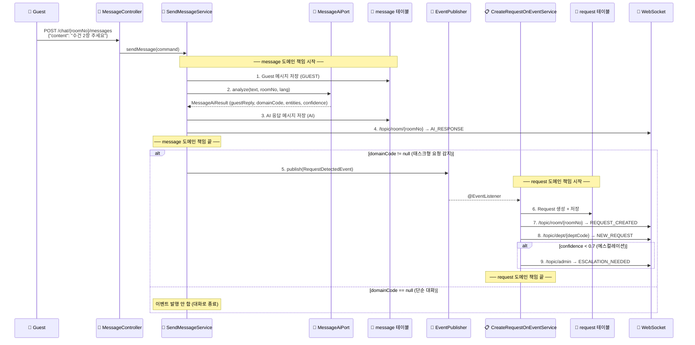

# Message × Request 통합 워크플로우 설계 (최종)

> **목표:** 메시지(Chat) 도메인과 요청(Request) 도메인의 책임 경계를 완벽히 분리하고, 이벤트 기반 통신으로 Git 충돌 0%를 달성하는 통합 워크플로우
>
> **확정 결정사항:**
> - AI 호출은 `message/` 도메인이 자체 Port(`MessageAiPort`)로 주도
> - 도메인 간 통신은 `RequestDetectedEvent` (Spring ApplicationEvent) 1개로 처리
> - 이벤트 객체는 `infrastructure/event/`에 배치 (기존 공유 인프라 레이어 활용)
> - 빠른 요청 패널은 후순위 — 핵심 파이프라인(채팅→AI→이벤트→Request) 우선
> - `ai/` 독립 도메인 없음 — AI는 각 모듈의 `adapter/out/ai/`에서 처리 (아키텍처 원칙 준수)

---

## 1. 최종 백엔드 패키지 구조

```
com.anook/
│
├── config/                              ── 전역 설정 ──
├── security/                            ── 인증 + JWT ──
├── error/                               ── 전역 예외 ──
├── util/                                ── 공통 유틸 ──
│
├── infrastructure/                      ── 공유 인프라 어댑터 ──
│   ├── websocket/
│   │   └── WebSocketDispatchAdapter.java
│   └── event/                           ── ★ 모듈 간 통신 이벤트 ──
│       └── RequestDetectedEvent.java    ← 유일한 공유 객체
│
│   ════════════════════════════════════
│   Guest 영역 (루트 레벨)
│   ════════════════════════════════════
│
├── message/                             ── 🟦 사용자 전담 ──
│   ├── domain/model/
│   │   ├── Message.java                 ← 순수 POJO
│   │   └── SenderType.java             ← Enum (GUEST, AI, STAFF)
│   ├── application/
│   │   ├── port/
│   │   │   ├── in/
│   │   │   │   ├── SendMessageUseCase.java
│   │   │   │   └── GetMessageHistoryUseCase.java
│   │   │   └── out/
│   │   │       ├── MessageRepositoryPort.java
│   │   │       ├── MessageAiPort.java   ← ★ AI Port (이 모듈 소유)
│   │   │       └── DispatchPort.java
│   │   ├── service/
│   │   │   ├── SendMessageService.java  ← AI 호출 + 이벤트 발행
│   │   │   └── GetMessageHistoryService.java
│   │   └── dto/
│   │       ├── request/
│   │       │   └── SendMessageCommand.java
│   │       └── response/
│   │           ├── MessageAiResult.java ← AI 응답 DTO (이 모듈 소유)
│   │           └── SendMessageResult.java
│   └── adapter/
│       ├── in/web/
│       │   └── GuestMessageController.java
│       └── out/
│           ├── persistence/
│           │   ├── MessageJpaEntity.java
│           │   ├── MessageJpaRepository.java
│           │   └── MessagePersistenceAdapter.java
│           └── ai/
│               ├── PythonAiHttpAdapter.java  ← 🟦 사용자: 실제 AI 연동
│               └── MockAiAdapter.java        ← 🟧 팀원: 테스트용 (@Profile("dev"))
│
├── request/                             ── 🟧 팀원 전담 ──
│   ├── domain/model/
│   │   ├── Request.java                 ← 순수 POJO (Aggregate Root)
│   │   │   ├── changeStatus(newStatus)
│   │   │   ├── escalate(reason)
│   │   │   └── isOverdue()
│   │   ├── RequestStatus.java           ← Enum (PENDING, ASSIGNED, IN_PROGRESS, ...)
│   │   ├── Priority.java               ← Enum (LOW, NORMAL, HIGH, URGENT)
│   │   └── DomainCode.java             ← Enum (HK, FB, FACILITY, CONCIERGE, FRONT, EMERGENCY)
│   ├── application/
│   │   ├── port/
│   │   │   ├── in/
│   │   │   │   ├── GetMyRequestsUseCase.java
│   │   │   │   └── ChangeRequestStatusUseCase.java
│   │   │   └── out/
│   │   │       ├── RequestRepositoryPort.java
│   │   │       └── DispatchPort.java
│   │   ├── service/
│   │   │   ├── CreateRequestOnEventService.java  ← ★ @EventListener
│   │   │   ├── GetMyRequestsService.java
│   │   │   └── ChangeRequestStatusService.java
│   │   └── dto/
│   │       ├── request/
│   │       └── response/
│   │           └── GetRequestDetailResult.java
│   └── adapter/
│       ├── in/web/
│       │   └── GuestRequestController.java
│       └── out/
│           └── persistence/
│               ├── RequestJpaEntity.java
│               ├── RequestJpaRepository.java
│               └── RequestPersistenceAdapter.java
│           ← ❌ ai/ 없음 (Request는 AI를 호출하지 않음)
│
├── knowledge/                           ── (별도 담당) ──
├── staff/task/                          ── (별도 담당) ──
└── admin/                               ── (별도 담당) ──
```

---

## 2. 의존 방향

```
message/  ──→  infrastructure/event/RequestDetectedEvent  ←──  request/
    │                                                            │
    ↓                                                            ↓
message/port/out/MessageAiPort                      request/port/out/RequestRepositoryPort
    │                                                            │
    ↓                                                            ↓
message/adapter/out/ai/                             request/adapter/out/persistence/
(PythonAiHttpAdapter | MockAiAdapter)               (RequestPersistenceAdapter)

✅ message ↛ request (독립)
✅ request ↛ message (독립)
✅ 공유 파일: infrastructure/event/RequestDetectedEvent.java 1개뿐
```

---

## 3. 소유권 매트릭스 (Git 충돌 방어)

> [!IMPORTANT]
> 두 담당자가 **절대 같은 파일을 수정하지 않도록** 하는 핵심 규칙

| 영역 | 소유자 | 패키지/폴더 | 상대방 |
|------|--------|-------------|--------|
| `message/` 전체 | 🟦 사용자 | `com.anook.message/**` | ❌ 팀원 수정 금지 |
| `message/adapter/out/ai/PythonAiHttpAdapter` | 🟦 사용자 | 실제 AI 연동 | ❌ 팀원 수정 금지 |
| `message/adapter/out/ai/MockAiAdapter` | 🟧 팀원 | 테스트용 Mock | ❌ 사용자 수정 금지 |
| `infrastructure/event/RequestDetectedEvent` | 🟦 사용자 (정의 주도) | 이벤트 객체 | 🟧 읽기 전용 |
| `request/` 전체 | 🟧 팀원 | `com.anook.request/**` | ❌ 사용자 수정 금지 |
| 프론트 `chat/[roomNo]/chat/` | 🟦 사용자 | 대화 화면 | ❌ 팀원 수정 금지 |
| 프론트 `chat/[roomNo]/status/` | 🟧 팀원 | 요청 상태 화면 | ❌ 사용자 수정 금지 |
| `infrastructure/websocket/` | 🟢 공유 | 먼저 머지한 쪽 우선 | 조율 필요 |

---

## 4. 통합 시퀀스 다이어그램



---

## 5. 공유 이벤트 객체 상세

```java
// 위치: infrastructure/event/RequestDetectedEvent.java
// 소유: 🟦 사용자 정의 주도, 🟧 팀원 읽기 전용

@Getter
public class RequestDetectedEvent extends ApplicationEvent {

    private final String roomNo;           // "302"
    private final String domainCode;       // "HK"
    private final String priority;         // "NORMAL"
    private final Map<String, Object> entities;  // {"item": "towel", "qty": 2}
    private final double confidence;       // 0.95
    private final String rawText;          // "수건 2장 주세요" (고객 원문)
    private final String summary;          // "수건 2장 요청" (AI 요약)
    private final boolean escalated;       // false (confidence < 0.7이면 true)

    public RequestDetectedEvent(Object source, String roomNo, String domainCode,
                                 String priority,
                                 Map<String, Object> entities, double confidence,
                                 String rawText, String summary, boolean escalated) {
        super(source);
        this.roomNo = roomNo;
        this.domainCode = domainCode;
        this.priority = priority;
        this.entities = entities;
        this.confidence = confidence;
        this.rawText = rawText;
        this.summary = summary;
        this.escalated = escalated;
    }
}
```

---

## 6. 핵심 서비스 코드 (message 도메인)

```java
// 위치: message/application/service/SendMessageService.java
// 담당: 🟦 사용자

@Service
@RequiredArgsConstructor
public class SendMessageService implements SendMessageUseCase {

    private final MessageRepositoryPort messagePort;
    private final MessageAiPort aiPort;              // ← message 모듈 자체 Port
    private final DispatchPort dispatchPort;
    private final ApplicationEventPublisher eventPublisher;

    @Override
    @Transactional
    public SendMessageResult send(SendMessageCommand cmd) {
        // 1. Guest 메시지 저장
        Message guestMsg = Message.create(cmd.roomNo(), cmd.content(), SenderType.GUEST);
        messagePort.save(guestMsg);

        // 2. AI 호출 (message 모듈의 MessageAiPort)
        MessageAiResult analysis = aiPort.analyze(
            cmd.content(), cmd.roomNo(), cmd.guestLanguage()
        );

        // 3. AI 응답 메시지 저장
        Message aiMsg = Message.createAiReply(cmd.roomNo(), analysis.guestReply());
        messagePort.save(aiMsg);

        // 4. WebSocket Push
        dispatchPort.send("/topic/room/" + cmd.roomNo(), "AI_RESPONSE", aiMsg);

        // 5. 태스크형 요청 감지 시 이벤트 발행 (여기서 message 책임 끝!)
        if (analysis.domainCode() != null) {
            eventPublisher.publishEvent(new RequestDetectedEvent(
                this,
                cmd.roomNo(),
                analysis.domainCode(),
                analysis.priority(),
                analysis.entities(),
                analysis.confidence(),
                cmd.content(),
                analysis.guestReply(),
                analysis.confidence() < 0.7
            ));
        }

        return new SendMessageResult(guestMsg.getId(), aiMsg.getId());
    }
}
```

---

## 7. 핵심 서비스 코드 (request 도메인)

```java
// 위치: request/application/service/CreateRequestOnEventService.java
// 담당: 🟧 팀원

@Service
@RequiredArgsConstructor
public class CreateRequestOnEventService {

    private final RequestRepositoryPort requestPort;
    private final DispatchPort dispatchPort;

    @EventListener
    @Transactional
    public void onRequestDetected(RequestDetectedEvent event) {
        // 1. Request 도메인 모델 생성
        Request request = Request.create(
            event.getRoomNo(),
            DomainCode.from(event.getDomainCode()),
            event.getEntities(),
            event.getConfidence(),
            event.getRawText(),
            event.getSummary()
        );

        // 2. 에스컬레이션 여부
        if (event.isEscalated()) {
            request.escalate("AI 확신도 부족: " + event.getConfidence());
        }

        // 3. 부서 자동 배정
        String deptCode = DomainCode.from(event.getDomainCode()).getDeptCode();

        // 4. DB 저장
        requestPort.save(request);

        // 5. WebSocket 알림
        dispatchPort.send("/topic/room/" + event.getRoomNo(), "REQUEST_CREATED", request);
        dispatchPort.send("/topic/dept/" + deptCode, "NEW_REQUEST", request);

        if (event.isEscalated()) {
            dispatchPort.send("/topic/admin", "ESCALATION_NEEDED", request);
        }
    }
}
```

---

## 8. Phase별 작업 계획

### Phase 0: 계약 정의 (🟦 사용자 → 🟧 팀원 pull) ✅ 완료

> Day 1 — 이 단계가 끝나야 독립 개발 시작 가능

| 순서 | 작업 | 담당 | 상태 |
|------|------|------|------|
| 0-1 | `infrastructure/event/RequestDetectedEvent.java` 정의 | 🟦 사용자 | ✅ 완료 |
| 0-2 | PR 머지 → 팀원 pull | 🟧 팀원 | ⬜ 대기 |

**파일 위치:** `backend/src/main/java/com/anook/backend/infrastructure/event/RequestDetectedEvent.java`
**컴파일 검증:** `./gradlew compileJava` → BUILD SUCCESSFUL ✅

**완료 기준:** 팀원이 `RequestDetectedEvent`를 import하여 컴파일 성공

---

### Phase MS: Message 도메인 (🟦 사용자 전담)

> Jira: AN-164 ~ AN-170
> **전제: MockAiAdapter를 사용하여 개발. AI 서버 완성 후 PythonAiHttpAdapter로 전환**

| Phase | Jira | 작업 | 핵심 산출물 |
|-------|------|------|-------------|
| MS-1 | AN-166 | Message 테이블 DDL + 도메인 모델 + DB 어댑터 | `Message.java`, `MessagePersistenceAdapter` |
| MS-2 | AN-164 | MessageAiPort 인터페이스 정의 + MockAiAdapter 구현 | `MessageAiPort.java`, `MockAiAdapter.java` |
| MS-3 | AN-164 | 메시지 전송 기능 `POST /chat/{roomNo}/messages` (Mock AI 연동) | `SendMessageService`, `GuestMessageController` |
| MS-4 | AN-164 | AI 응답 저장 + **RequestDetectedEvent 발행** | `SendMessageService` 완성 |
| MS-5 | AN-168 | AI 응답 비동기 처리 + 디바운스 | `@Async` 적용 |
| MS-6 | AN-165 | 대화 내역 조회 `GET /chat/{roomNo}/messages` | `GetMessageHistoryService` |
| MS-7 | AN-169 | 프론트: 고객 대화 화면 | `chat/[roomNo]/chat/**` |
| MS-8 | AN-170 | 프론트: AI 응답 실시간 수신 + 타이핑 스켈레톤 | `TypingIndicator/` |

> [!IMPORTANT]
> **AN-167 (PythonAiHttpAdapter 구현)은 AI 서버 완성 후로 이동합니다.**
> AI 서버가 준비되면 `@Primary` 어노테이션으로 MockAiAdapter를 대체하여 코드 변경 없이 전환 가능.

---

### Phase RQ: Request 도메인 (🟧 팀원 전담)

> Jira: AN-171 ~ AN-175, AN-177
> **전제: 이벤트 시뮬레이터(TestEventController)로 독립 개발**

| Phase | Jira | 작업 | 핵심 산출물 |
|-------|------|------|-------------|
| RQ-1 | AN-174 | Request 테이블 DDL + 도메인 모델 + DB 어댑터 | `Request.java`, `RequestPersistenceAdapter` |
| RQ-2 | AN-171,172 | **`@EventListener`** — RequestDetectedEvent 수신 → Request 생성 + 부서 배정 | `CreateRequestOnEventService` |
| RQ-3 | AN-173 | 본인 요청 상태 조회 `GET /chat/{roomNo}/requests` | `GuestRequestController` |
| RQ-4 | — | 직원용 상태 변경 API (수락/완료 — curl 테스트용) | `PATCH /requests/{id}/accept\|complete` |
| RQ-5 | AN-175 | WebSocket 실시간 알림 연결 | `DispatchPort` 호출 |
| RQ-6 | AN-177 | 프론트: 요청 상태 카드 (고객용) | `chat/[roomNo]/status/**` |

> [!TIP]
> 빠른 요청 패널(AN-176)은 핵심 파이프라인 완성 후 후순위로 진행합니다.

---

### 팀원 독립 테스트 전략

팀원은 Phase 0 이후 Message 도메인 없이도 전체 Request 파이프라인 테스트 가능:

```java
// 테스트 전용 이벤트 시뮬레이터 (@Profile("dev"))
// 위치: request/adapter/in/web/ 또는 별도 test 컨트롤러

@Profile("dev")
@RestController
@RequestMapping("/test")
public class TestEventController {

    private final ApplicationEventPublisher eventPublisher;

    @PostMapping("/simulate-request")
    public ResponseEntity<String> simulate(@RequestBody Map<String, Object> body) {
        eventPublisher.publishEvent(new RequestDetectedEvent(
            this,
            (String) body.get("roomNo"),
            "HK", "NORMAL",
            Map.of("item", "towel", "qty", 2),
            0.95, "수건 2장 주세요", "수건 2장 요청", false
        ));
        return ResponseEntity.accepted().body("Event published");
    }
}
```

---

## 9. 기존 RQ_Request_Workflow.md 변경 사항

| 기존 (RQ_Request_Workflow) | 변경 | 이유 |
|---------------------------|------|------|
| `POST /api/requests`에서 직접 AI 호출 | ❌ 삭제 → 이벤트 수신으로 대체 | Request는 AI를 호출하지 않음 |
| `request/adapter/out/ai/` 폴더 | ❌ 삭제 | AI 어댑터는 message 모듈 소유 |
| `global/port/out/AiAnalyzePort` | ❌ 삭제 → `message/port/out/MessageAiPort` | 각 모듈이 자체 Port 소유 (아키텍처 원칙) |
| Phase 2의 요청 접수 시 message 저장 | ❌ 삭제 | Message 도메인 책임 |
| Phase 1의 MockAiAdapter 위치 | `infrastructure/ai/` → `message/adapter/out/ai/` | MessageAiPort를 구현하므로 message 모듈에 배치 |

---

## 10. 타임라인 (병렬 개발)

```
        Day 1         Day 2-3        Day 4-5        Day 6-7
        ─────         ──────────     ──────────     ──────────
🟦 Chat  Phase 0       MS-1~2        MS-3~6         MS-7~8
         (계약 정의)    (기반+MockAI)  (API+이벤트)   (FE)

🟧 Req                 RQ-1          RQ-2~4         RQ-5~6
                       (기반)         (이벤트+API)   (실시간+FE)

                      ←── 완전 독립 개발 (Mock AI) ──→  ←── 통합 테스트 ──→

        ─── AI 서버 완성 후 ───
        AN-167: PythonAiHttpAdapter 구현 → @Primary로 Mock 교체
```

---

## 11. AI 전환 체크리스트

> [!IMPORTANT]
> AI 서버 완성 후 아래만 수행하면 Mock → 실제 전환 완료

- [ ] AN-167: `PythonAiHttpAdapter` 구현 (`POST http://ai:8000/analyze`)
- [ ] `@Primary` 어노테이션으로 MockAiAdapter 대체
- [ ] `docker-compose.yml`의 AI 서비스 주석 해제
- [ ] MockAiAdapter에 `@Profile("dev")` 유지 (개발 환경 폴백)

---

## 12. Verification Plan

### Phase 0 검증
```bash
./gradlew compileJava
# RequestDetectedEvent + MockAiAdapter 컴파일 확인
```

### 🟦 Message 독립 검증 (Mock AI)
```bash
# 메시지 전송 → MockAiAdapter 호출 → 고정 응답 → 이벤트 발행
curl -X POST http://localhost:8080/chat/302/messages \
  -H "Content-Type: application/json" \
  -d '{"content":"수건 2장 주세요"}'
# → message 테이블에 GUEST + AI 2건 저장 확인
# → MockAiAdapter의 고정 응답("수건 2장 보내드리겠습니다") 확인
# → 로그에 RequestDetectedEvent 발행 확인
```

### 🟧 Request 독립 검증
```bash
# 이벤트 시뮬레이션 → Request 생성
curl -X POST http://localhost:8080/test/simulate-request \
  -H "Content-Type: application/json" \
  -d '{"roomNo":"302"}'
# → request 테이블에 PENDING 1건 확인

# 상태 조회
curl http://localhost:8080/chat/302/requests
```

### 통합 검증 (머지 후)
```bash
# 1. 메시지 전송 → MockAI → 이벤트 → Request 자동 생성 전체 파이프라인
curl -X POST http://localhost:8080/chat/302/messages \
  -H "Content-Type: application/json" \
  -d '{"content":"수건 2장 주세요"}'

# 2. 확인사항:
#    - message 테이블: GUEST + AI 메시지 2건
#    - request 테이블: PENDING 1건
#    - WebSocket /topic/room/302: AI_RESPONSE + REQUEST_CREATED 수신
#    - WebSocket /topic/dept/HK: NEW_REQUEST 수신
```
