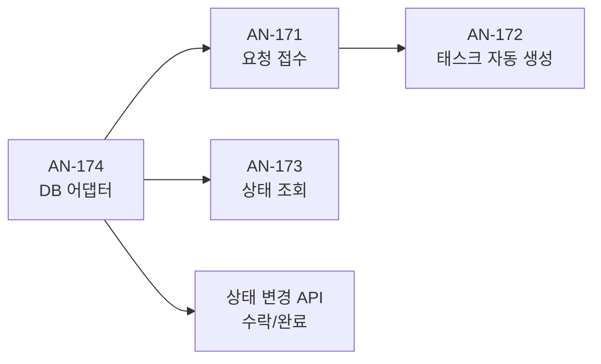

# RQ (Request) 도메인 구현 워크플로우

> **목표:** Mock AI 기반으로 고객 요청 접수 → 태스크 생성 → 상태 추적 → 실시간 알림 전체 파이프라인 완성
>
> **전제:** AI 서버 미완성 → MockAiAdapter로 대체, Message/Staff Task 도메인 미구현 → curl로 상태 변경 테스트

---

## Phase 1: 기반 (DB + 도메인 모델 + Mock AI)

> 다른 Phase의 전제 조건. 이 단계가 끝나야 API 개발 가능

### 1-1. Request 테이블 DDL

`schema.sql`에 추가:

```sql
CREATE TABLE IF NOT EXISTS request (
    id              BIGSERIAL PRIMARY KEY,
    room_no         VARCHAR(10) NOT NULL,
    domain_code     VARCHAR(20) NOT NULL,       -- HK, FB, CONCIERGE, FACILITY, EMERGENCY, FRONT
    intent          VARCHAR(50) NOT NULL,        -- SUPPLY_REQUEST, ROOM_SERVICE 등
    entities        JSONB DEFAULT '{}',          -- { item: "towel", qty: 2 }
    status          VARCHAR(20) NOT NULL DEFAULT 'PENDING',  -- PENDING → ACCEPTED → DONE
    confidence      DECIMAL(3,2),
    guest_reply     TEXT,                        -- AI가 고객에게 보낸 응답 텍스트
    dept_code       VARCHAR(20),                -- 배정된 부서 코드
    version         BIGINT DEFAULT 0,            -- 낙관적 락 (동시 수락 충돌 방지)
    created_at      TIMESTAMP DEFAULT NOW(),
    updated_at      TIMESTAMP DEFAULT NOW()
);
```

### 1-2. 시드 데이터 초기화 (`data.sql`)

프론트엔드 UI 연동 및 상태 변경 API 테스트를 위해 `src/main/resources/data.sql`에 초기 데이터를 삽입합니다.

```sql
-- 테스트용 PENDING, ACCEPTED, DONE 상태의 태스크 더미 데이터
INSERT INTO request (room_no, domain_code, intent, entities, status, guest_reply, dept_code) VALUES
('302', 'HK', 'SUPPLY_REQUEST', '{"item": "towel", "qty": 2}', 'PENDING', '수건 2장 객실로 보내드리겠습니다', '하우스키핑'),
('501', 'FB', 'ROOM_SERVICE', '{"item": "coffee", "qty": 1}', 'ACCEPTED', '커피 1잔 준비 중입니다', '식음료'),
('201', 'FACILITY', 'REPAIR_REQUEST', '{"item": "air_conditioner", "symptom": "not_working"}', 'DONE', '에어컨 수리 접수되었습니다', '시설관리');
```

### 1-3. 도메인 모델

| 클래스 | 위치 | 설명 |
|--------|------|------|
| `Request` | `request/domain/model/` | 엔티티 |
| `RequestStatus` | `request/domain/model/` | Enum: `PENDING`, `ACCEPTED`, `DONE`, `ESCALATED` |
| `DomainCode` | `global/domain/` | Enum: `HK`, `FB`, `CONCIERGE`, `FACILITY`, `EMERGENCY`, `FRONT` |

### 1-4. MockAiAdapter

```
global/port/out/AiAnalyzePort.java       ← 인터페이스
infrastructure/ai/MockAiAdapter.java     ← Mock 구현체
```

```java
// AiAnalyzePort.java
public interface AiAnalyzePort {
    AiAnalysisResult analyze(String message, String roomNo);
}

// MockAiAdapter.java — 1초 딜레이 + 고정 JSON 리턴
@Component
public class MockAiAdapter implements AiAnalyzePort {
    @Override
    public AiAnalysisResult analyze(String message, String roomNo) {
        Thread.sleep(1000); // AI 처리 시뮬레이션
        return AiAnalysisResult.builder()
            .domainCode("HK")
            .intent("SUPPLY_REQUEST")
            .entities(Map.of("item", "towel", "qty", 2))
            .confidence(0.95)
            .guestReply("수건 2장 객실로 보내드리겠습니다")
            .build();
    }
}
```

> [!TIP]
> AI 서버 완성 후 `AiHttpAdapter`를 만들어 `@Primary`로 교체하면 코드 변경 없이 전환 가능

### Phase 1 완료 후 검증

```bash
# 1. DB 테이블 및 시드 데이터 생성 확인
docker exec anook-local-db psql -U anook_user -d anook_db -c "SELECT * FROM request;"

# 2. MockAiAdapter 빈 로딩 확인 (서버 기동 로그에서 확인)
./gradlew bootRun
# 로그에 MockAiAdapter 또는 AiAnalyzePort 빈 등록 메시지 확인

# 3. 헬스체크
curl http://localhost:8080/actuator/health
```

---

## Phase 2: 백엔드 핵심 API (AN-171, 172, 173, 174)

> 요청의 생성 ~ 조회 ~ 상태 변경 CRUD 완성

### 작업 순서 (의존성 기반)



### AN-174: 요청 관리 DB 어댑터

| 파일 | 위치 |
|------|------|
| `RequestJpaEntity` | `request/adapter/out/persistence/` |
| `RequestRepository` | `request/adapter/out/persistence/` |
| `RequestPersistenceAdapter` | `request/adapter/out/persistence/` |
| `RequestMapper` | `request/adapter/out/persistence/` |

### AN-171: 고객 요청 접수

```
POST /api/requests
Body: { "roomNo": "302", "message": "수건 2장 부탁합니다" }

Response 202:
{ "requestId": 1, "status": "PENDING", "guestReply": "수건 2장 객실로 보내드리겠습니다" }
```

**내부 흐름:**
1. 메시지 수신
2. MockAiAdapter 호출 (비동기)
3. AI JSON 응답 기반 Request 저장
4. 202 응답 + WebSocket Push (Phase 3에서 연결)

### AN-172: AI JSON → 태스크 자동 생성 + 부서 배정

```java
// DomainCode → 부서 매핑
HK        → "하우스키핑"
FB        → "식음료"
FACILITY  → "시설관리"
CONCIERGE → "컨시어지"
EMERGENCY → "긴급대응" (자동 에스컬레이션)
FRONT     → "프론트" (Fallback)
```

- `confidence >= 0.7` → 자동 배정, status: `PENDING`
- `confidence < 0.7` → 관리자 컨펌 필요, status: `ESCALATED`

### AN-173: 고객 본인 요청 상태 조회

```
GET /api/requests?roomNo=302

Response:
[
  { "id": 1, "status": "ACCEPTED", "domain": "HK", "guestReply": "수건 2장...", "createdAt": "..." },
  { "id": 2, "status": "PENDING", "domain": "FB", "guestReply": "커피 1잔...", "createdAt": "..." }
]
```

### (추가) 직원용 상태 변경 API

> Staff/Task 도메인 완성 전까지 curl로 테스트하기 위한 간이 API. 
> **중요:** 다수 직원의 동시 수락을 방지하기 위해 JPA `@Version`을 이용한 **낙관적 락(Optimistic Locking)**을 적용해야 합니다. (Jira AN-178 연관)

```
PATCH /api/requests/{id}/accept    → PENDING → ACCEPTED (충돌 시 409 Conflict)
PATCH /api/requests/{id}/complete  → ACCEPTED → DONE
```

### Phase 2 완료 후 검증

```bash
# 1. 요청 접수
curl -X POST http://localhost:8080/api/requests \
  -H "Content-Type: application/json" \
  -d '{"roomNo":"302","message":"수건 2장 부탁합니다"}'

# 2. 상태 조회
curl http://localhost:8080/api/requests?roomNo=302

# 3. 직원이 수락
curl -X PATCH http://localhost:8080/api/requests/1/accept

# 4. 직원이 완료
curl -X PATCH http://localhost:8080/api/requests/1/complete
```

---

## Phase 3: 실시간 알림 (AN-175)

> 기존 WebSocket 인프라(DispatchPort) + Phase 2 API 연결

### 이벤트 발행 시점

| 상태 변경 | Push 채널 | 메시지 |
|-----------|-----------|--------|
| 요청 접수 (PENDING) | `/topic/room/{roomNo}` | 요청이 접수되었습니다 |
| | `/topic/dept/{deptCode}` | 새 태스크 알림 |
| 직원 수락 (ACCEPTED) | `/topic/room/{roomNo}` | 담당자가 처리를 시작했습니다 |
| 직원 완료 (DONE) | `/topic/room/{roomNo}` | 요청이 완료되었습니다 |
| 에스컬레이션 (ESCALATED) | `/topic/admin` | 관리자 컨펌 필요 |

### 구현 위치

```java
// RequestService 내부
public Request acceptRequest(Long requestId) {
    request.accept();  // 상태 전이
    requestPort.save(request);
    
    // WebSocket Push
    dispatchPort.pushToRoom(request.getRoomNo(), new StatusUpdateEvent("ACCEPTED", "담당자가 처리를 시작했습니다"));
    
    return request;
}
```

### Phase 3 완료 후 검증

**준비:** 브라우저에서 `http://localhost:3000/test/ws` 접속 → `/topic/room/302` 구독 확인

```bash
# 1. 요청 접수 → 브라우저에 "요청이 접수되었습니다" 수신 확인
curl -X POST http://localhost:8080/api/requests \
  -H "Content-Type: application/json" \
  -d '{"roomNo":"302","message":"수건 2장 부탁합니다"}'

# 2. 직원 수락 → 브라우저에 "담당자가 처리를 시작했습니다" 수신 확인
curl -X PATCH http://localhost:8080/api/requests/1/accept

# 3. 직원 완료 → 브라우저에 "요청이 완료되었습니다" 수신 확인
curl -X PATCH http://localhost:8080/api/requests/1/complete

# 4. 에스컬레이션 테스트 (confidence < 0.7 시나리오)
# → /topic/admin 구독 후 확인
curl -X POST http://localhost:8080/api/requests \
  -H "Content-Type: application/json" \
  -d '{"roomNo":"501","message":"알 수 없는 요청 테스트"}'
```

---

## Phase 3.5: 통합 테스트 페이지 (기존 /test/ws 확장)

> Phase 2 API + Phase 3 WebSocket을 **브라우저 하나로** 검증하는 시뮬레이터.
> curl 없이 고객+직원 역할을 동시에 테스트 가능

### 기능 구성

```
경로: /test/ws/page.tsx (기존 페이지 확장)
```

```
┌─────────────────────────────────────────────────────────┐
│  🔌 WebSocket 통합 테스트                                │
├──────────────────────┬──────────────────────────────────┤
│  🚪 고객 시뮬레이터    │  📨 실시간 수신 로그             │
│                      │                                  │
│  방번호: [302]        │  10:30 ● PENDING 요청 접수       │
│                      │  10:32 ● ACCEPTED 처리 시작      │
│  [🧴 수건] [💧 생수]  │  10:35 ● DONE 완료              │
│  [🧹 청소] [🍽️ 룸서비스]│                                │
│  [✏️ 직접 입력 전송]   │                                  │
├──────────────────────┤                                  │
│  👷 직원 시뮬레이터    │                                  │
│                      │                                  │
│  요청 #1 수건 2장     │                                  │
│  [수락] [완료]        │                                  │
│                      │                                  │
│  요청 #2 생수 1병     │                                  │
│  [수락] [완료]        │                                  │
└──────────────────────┴──────────────────────────────────┘
```

### 구현 항목

| 섹션 | 기능 | 호출 API |
|------|------|----------|
| 고객 시뮬레이터 | 방번호 입력 + 빠른 요청 버튼 | `POST /api/requests` |
| 고객 시뮬레이터 | 직접 메시지 입력 전송 | `POST /api/requests` |
| 직원 시뮬레이터 | 현재 PENDING 요청 목록 표시 | `GET /api/requests` |
| 직원 시뮬레이터 | 수락/완료 버튼 | `PATCH /api/requests/{id}/accept,complete` |
| 실시간 로그 | WebSocket 수신 메시지 표시 | `/topic/room/{roomNo}` 구독 |

### Phase 3.5 완료 후 검증

```bash
# 1. 백엔드 + 프론트엔드 실행
cd backend && ./gradlew bootRun
cd frontend && npm run dev

# 2. 브라우저에서 http://localhost:3000/test/ws 접속

# 3. 고객 영역: 방번호 302 입력 → 수건 버튼 클릭
#    → 실시간 로그에 "요청이 접수되었습니다" 표시

# 4. 직원 영역: 요청 #1 옆 [수락] 클릭
#    → 실시간 로그에 "담당자가 처리를 시작했습니다" 표시

# 5. 직원 영역: 요청 #1 옆 [완료] 클릭
#    → 실시간 로그에 "요청이 완료되었습니다" 표시
```

> [!TIP]
> 이 테스트 페이지가 있으면 Phase 4 고객 화면 개발 시 API 동작을 즉시 확인할 수 있어 개발 속도가 빨라집니다.
> 프로덕션 배포 전 `@Profile("dev")` 또는 삭제 처리합니다.

---

## Phase 4: 프론트엔드 (AN-176, 177)

### AN-176: 빠른 요청 패널 (고객용)

```
경로: /guest/quick/page.tsx
```

| 그리드 버튼 | API 호출 |
|------------|----------|
| 🧴 수건 | `POST /api/requests { message: "수건 요청" }` |
| 💧 생수 | `POST /api/requests { message: "생수 요청" }` |
| 🧹 청소 | `POST /api/requests { message: "객실 청소 요청" }` |
| 🍽️ 룸서비스 | `POST /api/requests { message: "룸서비스 요청" }` |
| 🔧 시설 수리 | `POST /api/requests { message: "시설 수리 요청" }` |
| 💬 기타 문의 | 채팅 화면으로 이동 |

### AN-177: 본인 요청 내역 및 실시간 상태 확인 페이지 (고객용)

```
경로: /guest/status/page.tsx
```

고객이 자신이 넣은 전체 요청 내역을 모아보고, 현재 진행 상태를 추적하는 페이지입니다. Phase 2에서 만든 `GET /api/requests?roomNo=...` API로 목록을 불러옵니다.

```
┌─────────────────────────────────────┐
│ 🧴 수건 2장 요청                     │
│                                      │
│  ● 접수완료 ──── ● 처리중 ──── ○ 완료 │
│  10:30         10:32               │
│                                      │
│  "담당자가 처리를 시작했습니다"         │
└─────────────────────────────────────┘
```

- `useWebSocket` 훅으로 `/topic/room/{roomNo}` 구독
- 상태 변경 Push 수신 시 카드 자동 갱신

### Phase 4 완료 후 검증

```bash
# 터미널 1: 백엔드 실행
cd backend && ./gradlew bootRun

# 터미널 2: 프론트엔드 실행
cd frontend && npm run dev

# 브라우저 탭 1: 고객 빠른 요청 패널
# http://localhost:3000/guest/quick
# → 수건 버튼 클릭 → 요청 접수 확인

# 브라우저 탭 2: 고객 상태 카드
# http://localhost:3000/guest/status
# → PENDING 카드 표시 확인

# 터미널 3: 직원 역할로 상태 변경
curl -X PATCH http://localhost:8080/api/requests/1/accept
# → 브라우저 탭 2에서 카드가 실시간으로 "처리중"으로 변경 확인

curl -X PATCH http://localhost:8080/api/requests/1/complete
# → 브라우저 탭 2에서 카드가 실시간으로 "완료"로 변경 확인
```

---

## 타임라인 요약

```
Phase 1 ━━━▶ Phase 2 ━━━━━━━━━━▶ Phase 3 ━━━▶ Phase 3.5 ━━━▶ Phase 4
(기반)       (API CRUD)           (실시간)      (테스트 페이지)    (FE)
 1일          2일                  1일           0.5일            2일

총 예상: 6.5일
```

## AI 전환 체크리스트

> [!IMPORTANT]
> AI 서버 완성 후 아래만 수행하면 전환 완료

- [ ] `AiHttpAdapter` 구현 (`POST http://ai:8000/analyze`)
- [ ] `@Primary` 어노테이션으로 MockAiAdapter 대체
- [ ] `docker-compose.yml`의 AI 서비스 주석 해제
- [ ] MockAiAdapter에 `@Profile("dev")` 추가
