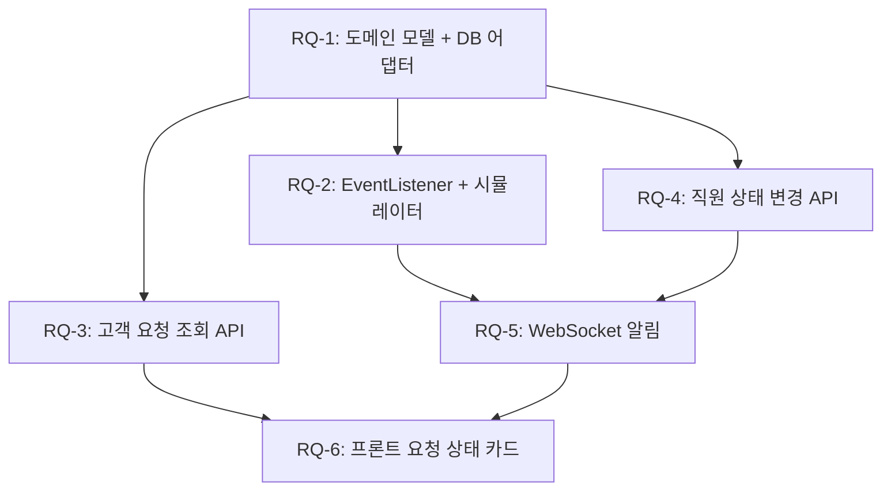

# RQ-1 ~ RQ-6: Request 도메인 전체 구현 계획서

> **브랜치:** `young/feat/AN-174/RQ-Request-domain`
> **설계서 근거:** [ms_rq_통합_워크플로우.md](file:///home/young/workspace/team3-Anook/docs/ms_rq_통합_워크플로우.md)
> **범위:** RQ(Request) 도메인만 — MS(Message) 도메인 파일 수정 0건

---

## 설계 결정사항

- ✅ `intent` 필드 사용 안 함 — `domainCode` + `entities`로 충분
- ✅ `room` 테이블 제거 — `roomNo`(VARCHAR) 자연키로 직접 저장
- ✅ `department` CRUD 없음 — 6개 고정 시드 데이터
- ✅ `staff/task` → `staff/request` 리네이밍 완료

---

## 현재 상태 분석

### 이미 존재하는 파일

| 파일 | 현재 상태 | 조치 |
|------|-----------|------|
| `RequestDetectedEvent.java` | ✅ 완료 | 읽기 전용 — 수정 안 함 |
| `RequestJpaEntity.java` | 기본 필드, `room_id` 사용 | **확장** (roomNo 전환 + 팩토리 메서드) |
| `RequestJpaRepository.java` | 기본 CRUD만 | **확장** (roomNo 쿼리 추가) |
| `RequestPersistenceAdapter.java` | settle용 최소 구현 | **확장** (save, findByRoomNo 추가) |
| `RequestRepositoryPort.java` | settle용 최소 인터페이스 | **확장** (save, findByRoomNo 추가) |
| `SettleRequestService.java` | ✅ 완료 | 수정 안 함 |
| `DispatchPort.java` (global) | ✅ 완료 | 수정 안 함 |
| `ErrorCode.java` | REQUEST_NOT_FOUND 존재 | **확장** (에러 코드 추가) |

---

## Proposed Changes

### RQ-1: Request 도메인 모델 + DB 어댑터 확장

> Jira: AN-174

---

#### [NEW] `request/domain/model/Request.java`

순수 POJO Aggregate Root. `roomNo`를 String으로 직접 보유.

```java
public class Request {
    private Long id;
    private RequestStatus status;
    private Priority priority;
    private DomainCode domainCode;
    private Map<String, Object> entities;
    private double confidence;
    private String rawText;
    private String summary;
    private String roomNo;           // ← room_id(FK) 대신 roomNo(VARCHAR) 직접 저장
    private Long assignedStaffId;
    private int version;
    private LocalDateTime createdAt;
    private LocalDateTime updatedAt;

    // 행위 메서드 (빈혈 도메인 금지)
    public static Request create(roomNo, domainCode, entities, confidence, rawText, summary)
    public void changeStatus(RequestStatus newStatus)
    public void escalate(String reason)
    public void assignStaff(Long staffId)
    public boolean isOverdue()
}
```

#### [NEW] `request/domain/model/RequestStatus.java`

```java
public enum RequestStatus {
    PENDING, ASSIGNED, IN_PROGRESS, COMPLETED, SETTLED, CANCELLED
}
```

#### [NEW] `request/domain/model/Priority.java`

```java
public enum Priority {
    LOW, NORMAL, HIGH, URGENT;
    public static Priority from(String value) { ... }
}
```

#### [NEW] `request/domain/model/DomainCode.java`

```java
public enum DomainCode {
    HK("HK"), FB("FB"), FACILITY("FACILITY"),
    CONCIERGE("CONCIERGE"), FRONT("FRONT"), EMERGENCY("EMERGENCY");
    public static DomainCode from(String value) { ... }
    public String getDeptCode() { return this.code; }
}
```

#### [MODIFY] [RequestJpaEntity.java](file:///home/young/workspace/team3-Anook/backend/src/main/java/com/anook/backend/request/adapter/out/persistence/RequestJpaEntity.java)

- `room_id` → `room_no VARCHAR(10)` 전환
- `static create(...)` 팩토리 메서드 추가 (Domain → Entity)
- `toDomain()` 메서드 추가 (Entity → Domain)

#### [MODIFY] [RequestJpaRepository.java](file:///home/young/workspace/team3-Anook/backend/src/main/java/com/anook/backend/request/adapter/out/persistence/RequestJpaRepository.java)

```java
List<RequestJpaEntity> findByRoomNo(String roomNo);
```

#### [MODIFY] [RequestRepositoryPort.java](file:///home/young/workspace/team3-Anook/backend/src/main/java/com/anook/backend/request/application/port/out/RequestRepositoryPort.java)

기존 `findStatusById`, `updateStatus` 유지 + 추가:

```java
Request save(Request request);
List<Request> findByRoomNo(String roomNo);
Optional<Request> findById(Long id);
```

#### [MODIFY] [RequestPersistenceAdapter.java](file:///home/young/workspace/team3-Anook/backend/src/main/java/com/anook/backend/request/adapter/out/persistence/RequestPersistenceAdapter.java)

기존 settle 메서드 유지 + 신규 Port 메서드 구현 추가.

> [!NOTE]
> **RoomLookupPort 불필요** — room 테이블을 제거하고 `roomNo`를 직접 저장하므로, roomNo→roomId 변환 로직 자체가 필요 없습니다.

---

### RQ-2: @EventListener — Request 자동 생성 + 부서 배정

> Jira: AN-171, AN-172

---

#### [NEW] `request/application/service/CreateRequestOnEventService.java`

```java
@Service
@RequiredArgsConstructor
public class CreateRequestOnEventService {
    private final RequestRepositoryPort requestPort;
    private final DispatchPort dispatchPort;

    @EventListener
    @Transactional
    public void onRequestDetected(RequestDetectedEvent event) {
        Request request = Request.create(
            event.getRoomNo(),              // roomNo 직접 사용 (변환 불필요)
            DomainCode.from(event.getDomainCode()),
            event.getEntities(),
            event.getConfidence(),
            event.getRawText(),
            event.getSummary()
        );
        if (event.isEscalated()) request.escalate("AI 확신도 부족: " + event.getConfidence());
        requestPort.save(request);
        // WebSocket 알림은 RQ-5에서 추가
    }
}
```

#### [NEW] `request/adapter/in/web/TestEventController.java`

`@Profile("dev")` — 이벤트 시뮬레이터. `POST /test/simulate-request`로 `RequestDetectedEvent` 수동 발행.

---

### RQ-3: 고객 요청 상태 조회 API

> Jira: AN-173

---

#### [NEW] `request/application/port/in/GetMyRequestsUseCase.java`

#### [NEW] `request/application/dto/response/GetRequestDetailResult.java`

```java
public record GetRequestDetailResult(
    Long id, String status, String priority, String departmentId,
    String summary, String rawText, double confidence,
    LocalDateTime createdAt, LocalDateTime updatedAt
) { ... }
```

#### [NEW] `request/application/service/GetMyRequestsService.java`

`requestPort.findByRoomNo(roomNo)` 직접 호출 (변환 불필요).

#### [NEW] `request/adapter/in/web/GuestRequestController.java`

```java
@RestController
@RequestMapping("/chat/{roomNo}/requests")
public class GuestRequestController {
    @GetMapping
    public ResponseEntity<List<GetRequestDetailResult>> getMyRequests(@PathVariable String roomNo)
}
```

---

### RQ-4: 직원용 상태 변경 API

#### [NEW] `request/application/port/in/ChangeRequestStatusUseCase.java`

#### [NEW] `request/application/service/ChangeRequestStatusService.java`

상태 전이: `accept` (PENDING→ASSIGNED), `complete` (ASSIGNED/IN_PROGRESS→COMPLETED)

#### [NEW] `request/adapter/in/web/StaffRequestController.java`

`PATCH /staff/requests/{id}/accept`, `PATCH /staff/requests/{id}/complete`

#### [MODIFY] [ErrorCode.java](file:///home/young/workspace/team3-Anook/backend/src/main/java/com/anook/backend/global/exception/ErrorCode.java) — `INVALID_STATUS_TRANSITION` 추가

---

### RQ-5: WebSocket 실시간 알림 연결

> Jira: AN-175

#### [MODIFY] `CreateRequestOnEventService.java` — WebSocket 발송 추가

#### [NEW] `request/application/dto/response/RequestWebSocketPayload.java`

#### [MODIFY] `ChangeRequestStatusService.java` — 상태 변경 시 WebSocket 알림

---

### RQ-6: 프론트엔드 — 요청 상태 카드

> Jira: AN-177

#### [NEW] `app/api/[...path]/route.ts` — BFF 프록시
#### [NEW] `app/guest/status/page.tsx`
#### [NEW] `app/guest/status/_components/RequestStatusCard/RequestStatusCard.tsx` + `.module.css`
#### [NEW] `app/guest/status/_components/StatusTimeline/StatusTimeline.tsx` + `.module.css`
#### [NEW] `app/guest/status/useRequestStatus.ts` — Co-location 훅

---

## 파일 생성/수정 총 목록

### 백엔드 (18 파일)

| 구분 | 파일 경로 |
|------|-----------|
| **[NEW]** | `request/domain/model/Request.java` |
| **[NEW]** | `request/domain/model/RequestStatus.java` |
| **[NEW]** | `request/domain/model/Priority.java` |
| **[NEW]** | `request/domain/model/DomainCode.java` |
| **[MODIFY]** | `request/adapter/out/persistence/RequestJpaEntity.java` |
| **[MODIFY]** | `request/adapter/out/persistence/RequestJpaRepository.java` |
| **[MODIFY]** | `request/adapter/out/persistence/RequestPersistenceAdapter.java` |
| **[MODIFY]** | `request/application/port/out/RequestRepositoryPort.java` |
| **[NEW]** | `request/application/service/CreateRequestOnEventService.java` |
| **[NEW]** | `request/adapter/in/web/TestEventController.java` |
| **[NEW]** | `request/application/port/in/GetMyRequestsUseCase.java` |
| **[NEW]** | `request/application/dto/response/GetRequestDetailResult.java` |
| **[NEW]** | `request/application/service/GetMyRequestsService.java` |
| **[NEW]** | `request/adapter/in/web/GuestRequestController.java` |
| **[NEW]** | `request/application/port/in/ChangeRequestStatusUseCase.java` |
| **[NEW]** | `request/application/service/ChangeRequestStatusService.java` |
| **[NEW]** | `request/adapter/in/web/StaffRequestController.java` |
| **[NEW]** | `request/application/dto/response/RequestWebSocketPayload.java` |
| **[MODIFY]** | `global/exception/ErrorCode.java` |

### 프론트엔드 (7 파일)

| 구분 | 파일 경로 |
|------|-----------|
| **[NEW]** | `app/api/[...path]/route.ts` |
| **[NEW]** | `app/guest/status/page.tsx` |
| **[NEW]** | `app/guest/status/_components/RequestStatusCard/RequestStatusCard.tsx` + `.module.css` |
| **[NEW]** | `app/guest/status/_components/StatusTimeline/StatusTimeline.tsx` + `.module.css` |
| **[NEW]** | `app/guest/status/useRequestStatus.ts` |

---

## 실행 순서



---

## Verification Plan

### RQ-2 독립 검증
```bash
curl -X POST http://localhost:8080/test/simulate-request \
  -H "Content-Type: application/json" \
  -d '{"roomNo":"707"}'
# → request 테이블에 room_no='707', status='PENDING' 1건 확인
```

### RQ-3 검증
```bash
curl http://localhost:8080/chat/707/requests
```

### RQ-4 검증
```bash
curl -X PATCH http://localhost:8080/staff/requests/{id}/accept
curl -X PATCH http://localhost:8080/staff/requests/{id}/complete
```
